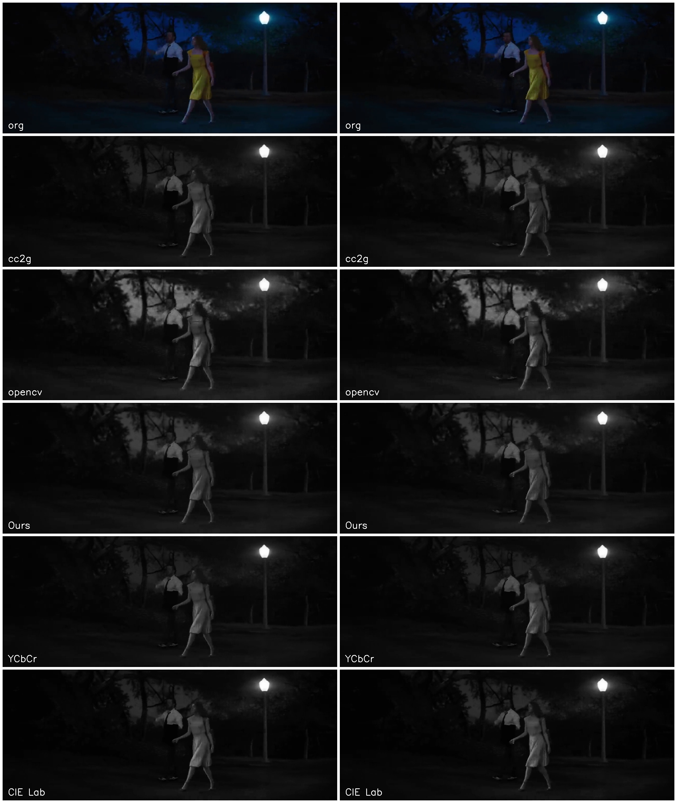
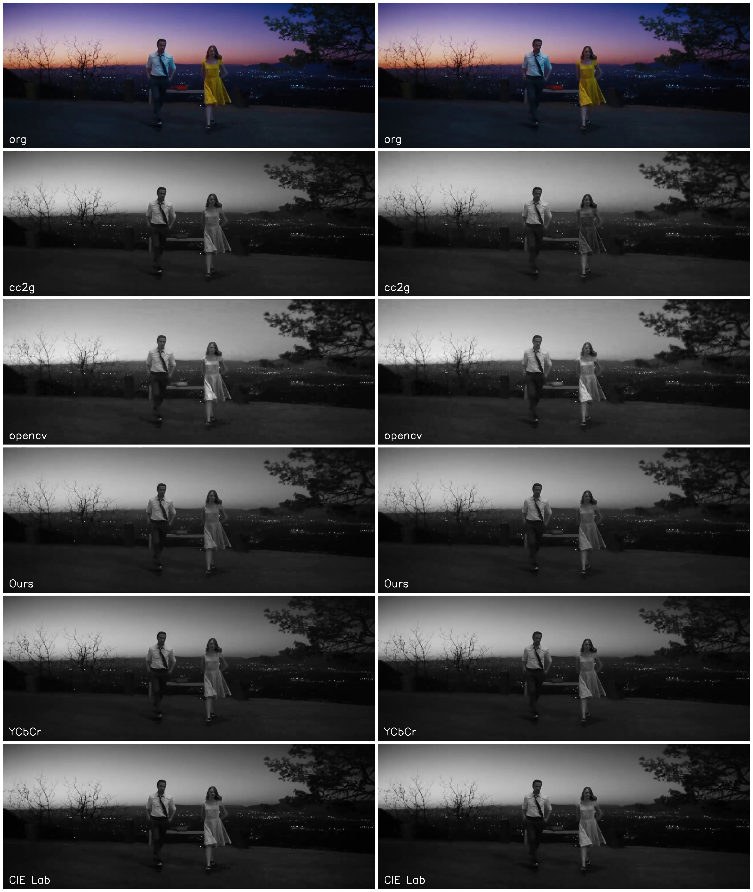

# Demo video for ECVP Poster

The demo video highlights the difficulties when processing videos. Many computer vision and image processing applications demand real-time operations.

From this video we can observe that preprocessing algorithms are suitable for practical applications, whereas contrast-based decolor videos appear incoherent.

[Video1](video/comparison1.mp4)

[Video2](video/comparison2.mp4)

References
[1] Lu et al. (OpenCV) [DOI:10.1007/s11263-014-0732-6](https://doi.org/10.1007/s11263-014-0732-6)

[2] LeDecolor [DOI:10.1109/TIP.2017.2745104](https://doi.org/10.1109/TIP.2017.2745104)

[3] CC2G [DOI:10.1109/LSP.2017.2755077](https://doi.org/10.1109/LSP.2017.2755077)

[4] Ours: [DOI:10.1117/1.JEI.30.4.043026](https://doi.org/10.1117/1.JEI.30.4.043026)